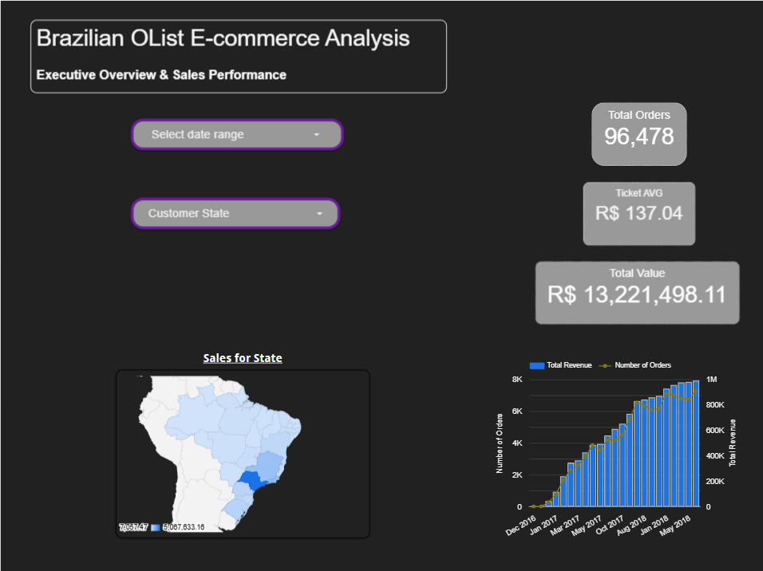
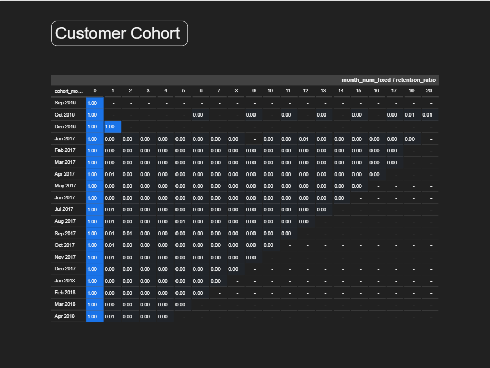
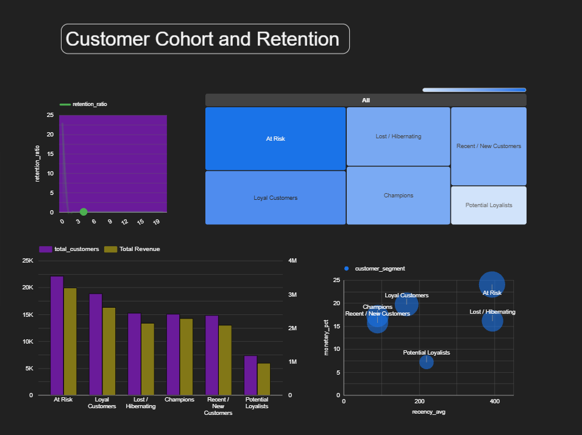

# 🛒 E-Commerce Análisis de Olist Brasil: Ventas Ejecutivas, Retención de Cohortes(Por Agrupación), Segmentación RFM y Market Basket.

Proyecto integral de análisis de datos (*End-to-End*) basado en más de **96,000 órdenes de comercio electrónico** de Olist Brasil (2016–2018). Desarrollado mediante modelado y transformación de datos en **Google BigQuery (SQL)** y visualizado a través de un **Dashboard Ejecutivo interactivo de 4 páginas en Looker Studio**.

---

## 📌 Resumen Ejecutivo y Hallazgos Clave de Negocio

* **El Reto de la Retención (Modelo 'One-and-Done'):** El análisis de cohortes a 20 meses revela una caída drástica tras la primera compra, manteniendo una tasa de recompra promedio en el Mes 1 ($M_1$) de entre **0.2% y 1.0%**. Olist opera primordialmente como un motor de captación y adquisición en lugar de un ecosistema de retención recurrente.
* **Concentración Geográfica y Logística:** Más del **60% del volumen total de ventas y facturación (R$ 13.22M)** se concentra en los estados de la región sureste (**São Paulo, Río de Janeiro y Minas Gerais**), señalando la zona prioritaria para optimización de paqueterías, convenios de envío y tiempos de entrega.
* **Segmentación de Clientes (Desbalance RFM):** Una proporción considerable de la base de usuarios pertenece a los segmentos *At Risk* (~22k clientes) y *Lost / Hibernating* (~15k clientes) debido a los altos días de inactividad (*Recency*), mientras que *Champions* y *Loyal Customers* sostienen las compras de mayor valor monetario.
* **Afinidad de Categorías (Market Basket):** El análisis de compra conjunta identificó patrones claros en el clúster de **Hogar y Decoración** (`bed_bath_table` + `furniture_decor` con 70 pedidos conjuntos, y `bed_bath_table` + `home_comfort` con 43 pedidos, representando la principal oportunidad para paquetes en carrito (*bundles*) y recomendaciones automáticas.

---

## 📊 Arquitectura del Dashboard en Looker Studio (4 Páginas)

### 1. Visión Ejecutiva y Desempeño de Ventas
* **KPIs Principales:** Total de Órdenes (**96,478**), Ticket Promedio (**R$ 137.04**), Facturación Total Bruta (**R$ 13,221,498.11**).
* **Evolución Temporal:** Gráfico combinado de doble eje comparando el volumen de órdenes mensuales vs. facturación (Dic 2016 – Ago 2018).
* **Inteligencia Geoespacial:** Mapa de calor de densidad regional por ingresos para los 27 estados de la República Federativa de Brasil (estándar ISO 3166-2).

---

### 2. Retención de Clientes por Cohortes (Matriz Triangular)
* **Matriz de Cohortes a 20 Meses:** Tabla dinámica completa que monitorea el comportamiento de recompra de cada cohorte desde el mes $0$ hasta el mes $20$.
* **Mapa de Calor de Decaimiento:** Formato condicional que visualiza con precisión el porcentaje de usuarios activos a lo largo del ciclo de vida.

---

### 3. Dinámica de Retención y Segmentación RFM
* **Curva de Retención Promedio:** Visualización de la tasa de retención mensual relativa ($M_0$ a $M_{20}$).
* **Distribución de Clientes (Treemap):** Proporción de la base de usuarios dividida en *At Risk*, *Lost / Hibernating*, *Loyal Customers*, *Champions*, *Recent / New Customers* y *Potential Loyalists.
* **Volumen de Clientes vs. Ingresos (Barras Agrupadas):** Comparativa del total de clientes frente a la aportación monetaria real de cada segmento.
* **Matriz de Comportamiento (Scatter Plot):** Dispersión de Días de Inactividad Promedio (`recency_avg`) vs. Aportación de Ingresos (`monetary_pct`).

---

### 4. Análisis de Canasta de Compra (Market Basket Analysis)
* **Ranking de Afinidad:** Top 10 de pares de categorías compradas en el mismo pedido ordenadas por frecuencia (`times_bought_together`), identificando combinaciones clave en muebles, blancos y artículos infantiles.

---

## 🛠️ Stack Tecnológico y Flujo de Datos

* **Data Warehouse en la Nube:** Google BigQuery
* **Transformación y Modelado:** SQL Estándar (CTEs, Window Functions `NTILE()`, Auto-Joins, `COALESCE`, `DATE_DIFF`)
* **Visualización e Inteligencia de Negocio:** Looker Studio
* **Dataset:** Olist Public Brazilian E-Commerce Dataset Kaggle
